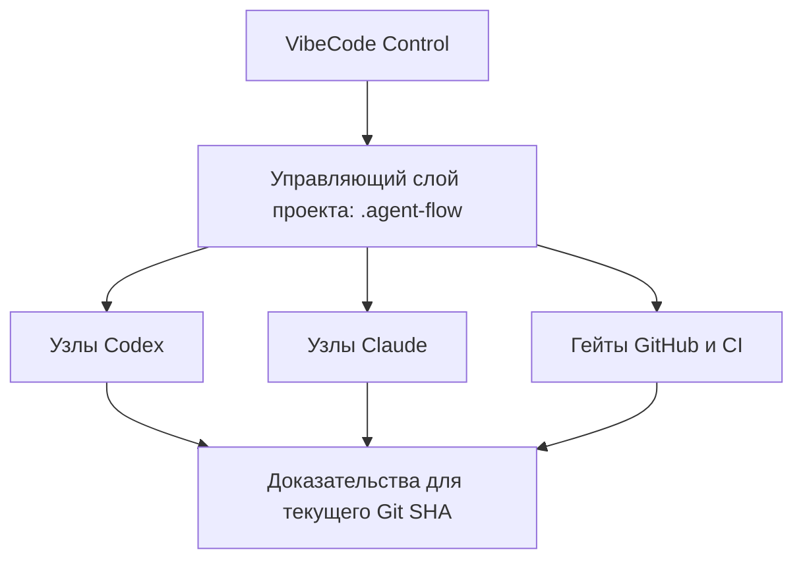

<p align="center">
  
</p>

<h1 align="center">VibeCode Control</h1>

<p align="center">
  Управляющий контур для контролируемой AI-разработки с Codex, Claude, GitHub и CI.
</p>

<p align="center">
  <code>v0.1.0</code> · Python 3.10+ · только стандартная библиотека · 61 автотест
</p>

<p align="center">
  <a href="#зачем-нужен-vibecode-control">Зачем</a> ·
  <a href="#что-он-делает">Возможности</a> ·
  <a href="#быстрый-старт">Быстрый старт</a> ·
  <a href="#основные-сценарии">Сценарии</a> ·
  <a href="#справочник-команд">Команды</a> ·
  <a href="#безопасность">Безопасность</a>
</p>

---

VibeCode Control — это переиспользуемый скилл и локальный CLI, который подключает к отдельному репозиторию проверяемый процесс AI-разработки.

Он не пишет продукт «по волшебной кнопке». Он задаёт агентам роли, этапы, разрешения и обязательные доказательства, проверяет готовность проекта и требует не выдавать предположение модели за пройденный тест, зелёный CI или готовый релиз.

> Каждый продукт остаётся в собственном репозитории. VibeCode Control устанавливает в него локальный управляющий слой и не превращается в общий репозиторий со всем кодом.

## Зачем нужен VibeCode Control

AI-агенты умеют быстро писать код, но скорость сама по себе не гарантирует управляемую разработку. Без общего контура часто возникают одни и те же проблемы:

| Проблема | Что делает VibeCode Control |
|---|---|
| Агент начинает работу без понимания проекта | Инспектирует репозиторий, документы, Git, тесты, CI и риски до изменений |
| Новый и legacy-проект подключаются одинаково | Разделяет безопасные режимы `init` и `adopt`, сначала показывает dry-run |
| Непонятно, кто и на какой модели выполняет этап | Хранит исполняемый граф ролей, агентов, моделей, effort и разрешений |
| Фоновый агент не видит нужные скиллы | Закрепляет версии, проверяет checksum и доставляет копии Codex и Claude |
| «Готово» подтверждено только текстом модели | Требует объективные проверки и evidence, привязанные к текущему Git SHA |
| Изменение конфигурации может повредить проект | Использует план, allowlist путей, SHA-256, атомарную запись и rollback |
| Процесс застрял или устарел | Диагностирует схему через `doctor` и переоценивает её через `scheme check` |

## Что он делает

- подключает новый или существующий репозиторий без массового переписывания файлов;
- ведёт настройку по этапам и всегда показывает один следующий практический шаг;
- хранит state graph разработки в `.agent-flow/workflow.json`;
- отделяет логические роли от конкретных агентов, моделей и permission profiles;
- требует по каждому узлу либо проверенный скилл, либо обоснованный `zero-skill`;
- закрепляет сторонние скиллы по commit SHA и контролирует их целостность;
- готовит проектные копии скиллов для `.agents/skills` и `.claude/skills`;
- проверяет Git, код, качество, CI, документацию, безопасность и skill dependencies;
- выполняет preflight отдельного фонового узла до запуска агента;
- записывает evidence конкретного запуска и связывает его с Issue, PR и head SHA;
- обнаруживает повреждённую или устаревшую схему и строит обратимый план исправления.

## Как это устроено



В репозиторий проекта устанавливаются конфигурация, граф, CLI, шаблоны и project-scoped skills. GitHub, CI, тесты и branch protection остаются внешними механизмами принуждения: наличие одного `SKILL.md` или workflow-файла не считается доказательством, что удалённый гейт действительно настроен.

### Что VibeCode Control не делает

- не принимает вместо владельца продукта решения о scope, roadmap, бюджете или `GO / PIVOT / HOLD / STOP`;
- не подменяет GitHub rulesets, required checks, CI, тесты или review;
- не меняет production, платные настройки и удалённые права без отдельного полномочия;
- не обновляет сторонние скиллы из сети во время обычного фонового запуска;
- не утверждает, что модель «точно применила скилл»: проверяются доставка, явный вызов, целостность и результат.

## Требования

- Python 3.10 или новее;
- Git для полноценной работы с репозиторием;
- Windows, Linux или macOS;
- доступ к GitHub нужен только для проверки или изменения удалённых настроек и PR. Локальные проверки работают без него.

CLI использует только стандартную библиотеку Python: устанавливать Python-пакеты не требуется.

## Установка

### Вариант 1. Запуск из клона

Подходит, если нужно сначала попробовать инструмент без установки скилла.

Windows PowerShell:

```powershell
git clone https://github.com/BelkovGB/VibeCode-Control.git "$env:USERPROFILE\Tools\VibeCode-Control"
$VibeCodeControl = "$env:USERPROFILE\Tools\VibeCode-Control"
py "$VibeCodeControl\scripts\devflow.py" --repo "C:\projects\my-app" inspect
```

Linux/macOS:

```bash
git clone https://github.com/BelkovGB/VibeCode-Control.git "$HOME/tools/VibeCode-Control"
VIBECODE_CONTROL_DIR="$HOME/tools/VibeCode-Control"
python3 "$VIBECODE_CONTROL_DIR/scripts/devflow.py" --repo /path/to/my-app inspect
```

### Вариант 2. Установка как пользовательского скилла Codex

Codex загружает пользовательские скиллы из `$HOME/.agents/skills`. Клонируйте репозиторий в отдельную папку скилла:

Windows PowerShell:

```powershell
git clone https://github.com/BelkovGB/VibeCode-Control.git "$env:USERPROFILE\.agents\skills\vibecode-control"
```

Linux/macOS:

```bash
git clone https://github.com/BelkovGB/VibeCode-Control.git "$HOME/.agents/skills/vibecode-control"
```

После установки вызовите скилл явно:

```text
$vibecode-control Проверь этот репозиторий, покажи этапы настройки, граф и рекомендуемые скиллы по узлам.
```

Codex обнаруживает изменения скиллов автоматически. Если скилл не появился, перезапустите Codex. Подробнее: [официальная документация OpenAI о скиллах](https://learn.chatgpt.com/docs/build-skills).

## Быстрый старт

Сначала всегда выполняйте инспекцию только для чтения:

```bash
python3 <vibecode-control>/scripts/devflow.py --repo <project> inspect
```

CLI сообщит рекомендуемый режим:

- `init` — новый или фактически пустой репозиторий;
- `adopt` — действующий или legacy-проект.

### Новый проект

```bash
# 1. Показать план и diff без записи
python3 <vibecode-control>/scripts/devflow.py --repo <project> init

# 2. Применить тот же режим после проверки diff
python3 <vibecode-control>/scripts/devflow.py --repo <project> init --apply

# 3. Дальше использовать установленный project-local CLI
cd <project>
python3 .agent-flow/devflow.py setup next
```

### Существующий проект

```bash
# 1. Более глубокая инспекция
python3 <vibecode-control>/scripts/devflow.py --repo <project> inspect --deep

# 2. Показать безопасный план подключения
python3 <vibecode-control>/scripts/devflow.py --repo <project> adopt

# 3. Применить после проверки diff
python3 <vibecode-control>/scripts/devflow.py --repo <project> adopt --apply

# 4. Продолжить по этапам настройки
cd <project>
python3 .agent-flow/devflow.py setup next
```

В Windows замените `python3 .agent-flow/devflow.py` на `py .agent-flow\devflow.py`.

## Основные сценарии

### 1. Понять, чего не хватает проекту

```bash
python3 .agent-flow/devflow.py setup check
python3 .agent-flow/devflow.py setup next
```

Каждый этап возвращает один из четырёх статусов:

| Статус | Значение |
|---|---|
| `PASS` | Требование подтверждено фактическими доказательствами |
| `PARTIAL` | Работу можно продолжать осторожно, но остаётся пробел или внешняя проверка |
| `BLOCKED` | Продолжение нарушит обязательное решение, проверку целостности или safety gate |
| `NOT_APPLICABLE` | Этап обоснованно не нужен этому проекту |

### 2. Посмотреть реальный граф работы

```bash
python3 .agent-flow/devflow.py graph --format mermaid
python3 .agent-flow/devflow.py graph --format table
python3 .agent-flow/devflow.py config show --effective
```

Диаграмма всегда строится из `.agent-flow/workflow.json`, поэтому не расходится с исполняемой конфигурацией.

### 3. Настроить роли, модели и права

```bash
python3 .agent-flow/devflow.py role set implementer claude-code
python3 .agent-flow/devflow.py model set reviewer <model> --effort xhigh
python3 .agent-flow/devflow.py permissions set merge merge-verified-sha
```

Изменения применяются к будущим запускам. Если доступность модели или effort не проверена на реальной платформе, статус останется `PARTIAL` или `BLOCKED` — скрытого fallback нет.

### 4. Выбрать скиллы для узлов

```bash
python3 .agent-flow/devflow.py skills recommend
python3 .agent-flow/devflow.py skills explain implement
python3 .agent-flow/devflow.py skills none --node quality_gates --reason "CI закрывает задачу"
python3 .agent-flow/devflow.py skills verify --node implement
```

`zero-skill` — нормальное решение, если задачу надёжнее закрывают модель, правила проекта, детерминированный скрипт, CI или другой объективный гейт.

### 5. Проверить узел перед фоновым запуском

```bash
python3 .agent-flow/devflow.py operate --node implement
```

Preflight проверяет граф, профиль исполнителя, разрешения, skill decisions, целостность локальных копий и доступность обязательных внешних условий.

### 6. Найти причину сбоя

```bash
# Быстрая офлайн-диагностика
python3 .agent-flow/devflow.py doctor

# Глубокая проверка всех слоёв
python3 .agent-flow/devflow.py audit all --deep

# Переоценка графа, ролей, моделей, гейтов и скиллов
python3 .agent-flow/devflow.py scheme check
```

`doctor` подходит для регулярной проверки. `scheme check` нужен при повторных сбоях, смене модели, стека или архитектуры, обновлении VibeCode Control или наступлении даты пересмотра скилла.

### 7. Проверить или откатить применённый план

```bash
python3 .agent-flow/devflow.py verify <run-id> --expected-manifest-sha256 <manifest-sha256>
python3 .agent-flow/devflow.py rollback <run-id> --expected-manifest-sha256 <manifest-sha256>
```

Rollback остановится, если после применения управляемый файл был изменён вручную или другим агентом. Новая работа не затирается.

## Справочник команд

Ниже `devflow …` — короткая запись аргументов после префикса:

```text
python3 <path-to-devflow.py> --repo <project>
```

После `init` или `adopt` используйте project-local префикс `python3 .agent-flow/devflow.py`. Команда `devflow help` печатает точный префикс для текущего репозитория.

<details>
<summary><strong>Справка, инспекция и аудит</strong></summary>

```text
devflow --version
devflow help [overview|modes|setup|configuration|skills|safety|windows]
devflow inspect [--deep] [--output .agent-flow/.local/reports/<new-name>.json]
devflow audit git|code|quality|ci|docs|security|skills|all [--deep]
devflow doctor [--deep] [--refresh-skills] [--repair-plan]
devflow scheme check [--no-refresh-skills]
```

</details>

<details>
<summary><strong>Установка, обновление, планы и rollback</strong></summary>

```text
devflow init|adopt|upgrade [--apply] [--full-diff] [--diff-path <relative-path>]
devflow plan init|adopt|upgrade|repair [--output .agent-flow/.local/plans/<new-name>.json] [--full-diff] [--diff-path <relative-path>]
devflow apply --plan <relative-path> --expected-sha256 <reviewed-plan-sha256>
devflow verify <run-id> --expected-manifest-sha256 <manifest-sha256>
devflow rollback <run-id> --expected-manifest-sha256 <manifest-sha256>
devflow scheme repair [--apply]
```

Без `--apply` изменяющие режимы показывают план. Сохранённый план применяется только с SHA-256, который был выведен при сохранении именно этой версии плана.

</details>

<details>
<summary><strong>Этапы настройки и статус</strong></summary>

```text
devflow setup check [--stage <id>]
devflow setup next
devflow setup mark <stage> <PASS|PARTIAL|BLOCKED|NOT_APPLICABLE> --evidence <reference> [--note <text>]
devflow status
devflow next
```

`setup mark` предназначен только для доказательств, которые нельзя получить локально. Ручной `PASS` не перекрывает детерминированную ошибку схемы, checksum или безопасности.

</details>

<details>
<summary><strong>Граф, конфигурация, роли и модели</strong></summary>

```text
devflow graph --format mermaid|table|json
devflow config show [--effective]
devflow config set <dotted-path> <JSON-or-string>
devflow role set <role> <agent>
devflow model set <role-or-node> <model> [--effort <level>]
devflow permissions set <role-or-node> <profile>
```

</details>

<details>
<summary><strong>Управление зависимыми скиллами</strong></summary>

```text
devflow skills list
devflow skills recommend|plan [--node <id>]
devflow skills explain <node>
devflow skills search [--node <id>]
devflow skills register|update <name> --path <folder> --source <url> --commit <40-char-sha> --license <license> [--targets claude,codex] --approved-by-user [--apply]
devflow skills assign <name> --node <id> [--level required|recommended|optional] [--reason <text>]
devflow skills none --node <id> --reason <text>
devflow skills unassign <name> --node <id>
devflow skills remove <name> [--apply]
devflow skills audit [--node <id>] [--deep]
devflow skills verify [--node <id>]
devflow skills sync [--apply]
devflow skills evaluate <node>
```

Регистрация требует предварительного аудита точного содержимого, полного commit SHA и явного подтверждения пользователя. Обычный run ничего не скачивает из сети.

</details>

<details>
<summary><strong>Фоновые узлы и evidence</strong></summary>

```text
devflow operate --node <id>
devflow run record --node <id> --status <status> --head-sha <sha> --issue <ref> --pr <ref> --evidence "<expected-evidence>=<artifact-ref>" [--actual-agent <id>] [--actual-model <id>] [--actual-effort <level>]
devflow run show [run-id]
```

Для успешной записи delivery-узла нужны фактический Git HEAD, чистое рабочее дерево, Issue/PR, пройденный preflight, реальный профиль исполнителя и отдельная ссылка на артефакт для каждого ожидаемого evidence.

</details>

Подробные пояснения и примеры: [references/setup-and-commands.md](references/setup-and-commands.md).

## Этапы первоначальной настройки

VibeCode Control ведёт репозиторий через десять независимых setup-этапов:

1. инспекция;
2. контекст продукта;
3. роли, агенты, модели, effort и permissions;
4. state graph;
5. каноническая документация;
6. локальный Git и удалённый GitHub;
7. baseline и quality gates;
8. решение по скиллам каждого узла;
9. фоновая автоматизация;
10. один низкорисковый пилотный Issue.

Этапы настройки не равны этапам продукта. Подсказка `setup next` не утверждает продуктовый scope и не заменяет решение PM.

## Безопасность

VibeCode Control спроектирован по принципу fail-closed:

- read-only команды не изменяют репозиторий;
- изменяющие команды сначала показывают план и diff;
- запись разрешена только внутри репозитория и по allowlist путей;
- symlink traversal, path traversal, force push и опасные операции блокируются;
- запись выполняется атомарно, а apply оставляет проверяемый rollback manifest;
- значения предполагаемых секретов не выводятся в отчёты;
- аудит стороннего скилла не исполняет его скрипты;
- evidence и готовность привязываются к текущему head SHA;
- непроверенные GitHub rulesets, required checks, модели и runners не получают ложный `PASS`.

Это защитный слой процесса, а не замена sandbox, branch protection, code review, CI или security tooling.

## Структура репозитория

| Путь | Назначение |
|---|---|
| [`SKILL.md`](SKILL.md) | Главная инструкция скилла и правила его срабатывания |
| [`scripts/devflow.py`](scripts/devflow.py) | Самодостаточный CLI управляющего контура |
| [`scripts/test_devflow.py`](scripts/test_devflow.py) | Unit- и regression-тесты CLI |
| [`assets/project-kit`](assets/project-kit) | Схемы, конфигурация, workflow и управляемые шаблоны для проекта |
| [`docs/ARCHITECTURE.md`](docs/ARCHITECTURE.md) | Фактические компоненты, потоки данных, источники истины и trust boundaries |
| [`references`](references) | Подробные правила настройки, графа, качества, безопасности и skill governance |
| [`agents/openai.yaml`](agents/openai.yaml) | Метаданные скилла для OpenAI-совместимых поверхностей |
| [`docs/skills-sh-audit-2026-08-02.md`](docs/skills-sh-audit-2026-08-02.md) | Датированный аудит похожих решений на skills.sh |

## Разработка и проверка

Проверить CLI перед PR:

```bash
python3 -m py_compile scripts/devflow.py scripts/test_devflow.py
python3 -m unittest discover -s scripts -p 'test_*.py' -v
python3 scripts/devflow.py --version
```

Текущий набор содержит 61 автоматический тест: установка и обновление, граф, rollback, checksum drift, повреждённая конфигурация, опасные сторонние скиллы, delivery evidence и remote-gate preflight.

## Дополнительные материалы

- [Полная справка и этапы настройки](references/setup-and-commands.md)
- [Архитектура и границы ответственности](docs/ARCHITECTURE.md)
- [Конфигурация и state graph](references/configuration-and-graph.md)
- [Процесс разработки и quality gates](references/process-and-quality.md)
- [Skill Dependency Manager](references/skill-governance.md)
- [GitHub, фоновые агенты и безопасность](references/adapters-and-security.md)
- [Аудит похожих скиллов на skills.sh](docs/skills-sh-audit-2026-08-02.md)

## Совместимость имён

Публичное имя скилла — `vibecode-control`. Внутренние идентификаторы `devflow`, `.agent-flow` и `devflow-node` сохранены для совместимости существующего CLI, project kit и установленных проектов.
