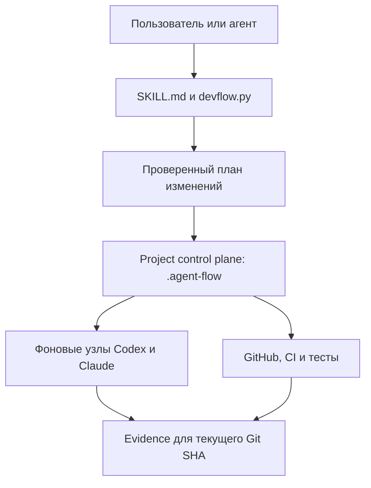

# Архитектура VibeCode Control

Документ описывает фактическую архитектуру версии `0.1.0`. Он фиксирует компоненты, источники истины, потоки данных и границы доверия. Правила работы агентов и quality gates находятся в тематических файлах из [`references`](../references).

## Назначение системы

VibeCode Control добавляет в отдельный продуктовый репозиторий локальный управляющий слой для AI-разработки. Этот слой:

- хранит исполняемую конфигурацию ролей и workflow;
- строит безопасные планы файловых изменений;
- проверяет целостность графа и зависимых скиллов;
- выполняет preflight фоновых узлов;
- связывает результаты проверок с Issue, PR и текущим Git SHA.

Система не исполняет GitHub rulesets, CI и branch protection вместо внешних платформ. Она проверяет локальную часть процесса и требует отдельно подтвердить удалённые гейты через доступный адаптер.

## Компоненты

| Компонент | Расположение | Ответственность |
|---|---|---|
| Скилл | [`SKILL.md`](../SKILL.md) | Определяет, когда и как агент использует VibeCode Control |
| Публичный CLI | [`scripts/devflow.py`](../scripts/devflow.py) | Инспекция, планы, apply/verify/rollback, настройка, аудит и preflight |
| Project kit | [`assets/project-kit`](../assets/project-kit) | Нейтральные шаблоны конфигурации, графа, схем, prompts и managed-блока `AGENTS.md` |
| Project-local CLI | `.agent-flow/devflow.py` в подключённом проекте | Самодостаточная копия CLI для дальнейшей работы без зависимости от личной установки |
| Личная копия скилла | `~/.agents/skills/vibecode-control`, `~/.claude/skills/vibecode-control` | Устанавливается `devflow install`; пишется только внутрь каталога скиллов выбранного клиента и сверяется по контрольной сумме с источником |
| Управляющие данные проекта | `.agent-flow/config.json`, `workflow.json`, `skills.lock.json` | Роли и типизированные параметры исполнения, state machine, skill dependencies и решения по узлам |
| Project-scoped skills | `.agents/skills` и `.claude/skills` | Явно доставленные и проверяемые инструкции для фоновых Codex и Claude |
| Локальные артефакты | `.agent-flow/.local` | Планы, отчёты, manifests, rollback payloads и run evidence; не коммитятся |
| Внешние гейты | GitHub, CI, tests, runners | Фактическое принуждение к required checks, review, merge policy и выполнению кода |

## Поток управления



Основная последовательность изменения проекта:

```text
inspect → normalize → plan → dry-run → apply → verify → reconcile
```

1. `inspect` собирает факты без записи.
2. `init`, `adopt`, `upgrade`, `graph --migrate` или `plan` строят типизированный набор операций и diff.
3. `apply` повторно проверяет fingerprint репозитория, пути и pre-hash каждого файла.
4. Файлы записываются атомарно; для запуска сохраняется manifest с предыдущими байтами.
5. Матрица эффективной конфигурации пересобирается из фактических файлов и сравнивается с утверждённой в плане; несовпадение прекращает apply и откатывает запись.
6. `verify` подтверждает результат, а `rollback` может вернуть конкретный запуск, только если после apply не появился drift.

## Установленный управляющий слой

После `init --apply` или `adopt --apply` проект получает следующую структуру:

```text
.agent-flow/
├── devflow.py
├── config.json
├── config.schema.json
├── workflow.json
├── workflow.schema.json
├── skills.lock.json
├── setup-stages.json
├── toolkit/
├── vendor-skills/
└── .local/                 # исключён из Git

.agents/skills/devflow-node/
.claude/skills/devflow-node/
.github/devflow/prompts/
.github/ISSUE_TEMPLATE/devflow-task.yml
```

VibeCode Control также добавляет или обновляет только помеченные managed-блоки в `AGENTS.md`, `CLAUDE.md`, `.gitignore` и шаблоне PR. Существующий пользовательский текст вокруг этих блоков сохраняется. Блок `CLAUDE.md` не копируется из шаблона, а генерируется из установленной конфигурации ролей.

## Источники истины

Единого файла с максимальным приоритетом для всех вопросов нет. Источник выбирается по типу факта:

| Вопрос | Канонический источник |
|---|---|
| Что реально работает | `main`, код, тесты и свежая эксплуатационная проверка |
| Что сейчас разрабатывается | Текущий head открытого PR, review threads и CI |
| Что должен выполнить агент | Ready Issue и его актуальные комментарии |
| Что входит в продукт | Утверждённый scope и product rules |
| Приоритеты и этапы | Roadmap, tracking Issues и последнее явное решение PM |
| Как исполняется AI-процесс | `.agent-flow/config.json` и `workflow.json`; managed-блоки `AGENTS.md` и `CLAUDE.md` производны от них |
| Какие model, effort и разрешения действуют на узле | Матрица `devflow config effective` с режимом и источником каждой ячейки |
| Какие скиллы разрешены | `.agent-flow/skills.lock.json` и проверенные materialized copies |

Для продуктовых решений последнее явное решение PM имеет приоритет. Для фактического поведения источником остаются код и свежие проверки.

## Модель конфигурации и workflow

### Конфигурация

`.agent-flow/config.json` отделяет логическую роль от конкретного исполнителя. Для роли хранятся:

- `agent`;
- `model`;
- `effort`;
- `permissions`.

Точечные `node_overrides` применяются только к указанному узлу; они объявлены в `config.schema.json` наравне с `roles`.

### Типизированные параметры исполнения

`model` и `effort` — не строки, а параметры с явным режимом. Канонический вид:

- `{"mode": "explicit", "value": "<модель или effort>"}` — значение выбрано и закреплено;
- `{"mode": "inherited"}` — значение определяет клиент во время запуска; его нужно наблюдать и зафиксировать, а не придумывать;
- `{"mode": "unset"}` — параметр намеренно отсутствует и никогда не материализуется в конкретное значение;
- `{"mode": "not-applicable"}` — роль не исполняет модель (агент `human`, `script`, `deterministic`).
- `{"mode": "undecided"}` — выбор ещё не сделан. Это состояние поставляет нейтральный шаблон; оно блокирует этап `roles`, preflight и запись PASS, пока владелец не решит.

Голая строка — легаси-запись. Она принимается при чтении и детерминированно нормализуется при записи: конкретное значение → `explicit`, `inherit` → `inherited`, `not-applicable` → `not-applicable`, `unset` и `unconfigured` → `unset`. Легаси-запись даёт предупреждение валидации с точным перечнем указателей. Объявленный режим `inherited` или `unset` предупреждения не даёт и не понижает preflight: это зафиксированное решение, а не пробел, и проверяется оно при записи доказательства, где обязательно указать фактически наблюдённое значение.

В схеме это `$defs.typedParameter` — `oneOf` из объекта с `value`, объекта только с режимом и легаси-строки. `schema_version` остаётся `1`.

Валидатор конфигурации требует: роль, чей агент не исполняет модель, использует `not-applicable` для обоих параметров; исполняющий агент не имеет права на `not-applicable`; отсутствующий ключ `model` или `effort` — ошибка с требованием написать `{"mode": "unset"}` явно, чтобы вместо него не появилось умолчание.

Ни один режим не доказывает доступность конкретной модели или effort на платформе.

### Разрешение и провенанс

Для `model` и `effort` порядок разрешения: `node_overrides[<узел>]` → `roles[<роль узла>]` → отсутствие. Для `permissions`: `node_overrides[<узел>]` → узел в `workflow.json` → `roles[<роль узла>]`.

Каждое разрешённое поле возвращает `{value, mode, source: {level, pointer, file}}`, где `level` — один из `node-override`, `role`, `node`, `absent`; `pointer` — например `roles.reviewer.model`; `file` — `.agent-flow/config.json` или `.agent-flow/workflow.json`. Вопрос «откуда взялось это значение» отвечается из отчёта, а не восстанавливается по памяти.

Ключи `model` и `effort` внутри узла `workflow.json` теперь ошибка валидации. Раньше они молча игнорировались: настройка выглядела действующей и создавала ложную уверенность, поэтому вместо тихого игнорирования выбран отказ.

### Реестр клиентских адаптеров и граница переносимости

Логика workflow общая для Codex и Claude. Конфигурация исполнения — клиентская: идентификаторы агентов, имена моделей, словари effort и профили разрешений не взаимозаменяемы и не копируются между клиентами без явного решения. Перенос этапа к другому клиенту не переносит с собой модель и effort исходного клиента.

### Транспорт сессий

Узлы исполняются заранее созданными чат-сессиями одного клиента: координация идёт межсессионными сообщениями, а не облачными runners. Это первый официальный runner-транспорт, и он держится на четырёх границах.

**Сессии — транспорт, не источник истины.** Backlog остаётся в GitHub Issues, evidence — в `run record` с head SHA, конфигурация — в `.agent-flow`. Переписка сессий доказательством не является: она не проверяема и не воспроизводима.

**Локальный Git обязателен всегда.** Постановка узла без head SHA невозможна. GitHub остаётся внешним принуждением: без него merge-гейты честно остаются `PARTIAL`/`BLOCKED`, и транспорт этого не маскирует.

**Способность клиентская.** Межсессионные сообщения объявляются адаптером флагом `session_messaging` в реестре клиентов, а не выводятся из имени клиента. Клиент без этого флага транспорт не получает и не эмулирует; проект расширяет реестр блоком `clients`, если его клиент такую способность имеет.

**CLI сессиями не управляет и их не видит.** `automation.sessions` — реестр «роль → имя заранее созданной сессии», объявленный владельцем. CLI проверяет его форму и инвариант изоляции, рендерит текст постановки и записывает evidence; маршрутизацию сообщений выполняет сессия-координатор. Жива ли сессия сейчас, прочитала ли она постановку и тот ли это чат — локально не проверяется, и это сказано словами в `session check`, в поле `transport` у `operate` и в самом тексте постановки. Заполненный реестр — заявление владельца; `automation.background_workers: verified` — независимое подтверждение, что владелец действительно наблюдал прогон. Ни одно из двух не заменяет другое.

Инвариант изоляции проверяется на разрешённых парах «узел → сессия», а не на ролях: сессия, исполняющая узел стадии `implementation`, не может исполнять узел стадии `review` с другой ролью. Саморевью остаётся легальным по построению — `implementer_review` принадлежит роли самого исполнителя.

Если сессия умерла посреди узла, узел перезапускается целиком от последнего записанного `run record`: он вместе с head SHA и есть чекпойнт. Продолжения мёртвой сессии с середины не существует.

### Дома промптов

Промпты живут в двух местах, и каждое привязано к транспорту:

| Дом | Транспорт | Содержимое |
| --- | --- | --- |
| `.github/devflow/prompts/` | GitHub Actions и облачные runners | промпты фоновых узлов, которые читает workflow GitHub |
| `.agent-flow/prompts/` | сессии | шаблон постановки узла, который рендерит `devflow session assign` |

Разделение не косметическое: транспорт сессий задуман работоспособным без GitHub, поэтому его шаблон не может лежать в `.github/`. Третий дом не появляется без явного решения — новый транспорт либо переиспользует один из этих двух, либо приходит вместе с решением, расширяющим эту таблицу.

### State machine

`.agent-flow/workflow.json` — единственный канонический граф. Каждый узел содержит входное условие, действие, роль, разрешения, входы, ожидаемые доказательства, проверки и timeout. Узел дополнительно может объявить `evidence_contract` — требование к артефактам, описанное ниже в разделе о границах доверия. Каждое ребро содержит именованное условие, ограничение повторов и явный выход при ошибке.

Валидатор блокирует, среди прочего:

- недостижимые узлы и ветки без терминального выхода;
- неизвестные роли и небезопасные условия;
- бесконечные циклы или retries без границы;
- merge-path без проверенного head SHA и обязательных проверок;
- обязательный скилл, недоступный фактическому исполнителю;
- ключ `evidence_contract`, отсутствующий в `expected_evidence`, неизвестный вид артефакта и небулево `required`;
- ключи `model` и `effort` внутри узла.

Узел этапа `review` без единого обязательного артефакта — не ошибка, а предупреждение: оно называет узел и сообщает, что `PASS` для него запрещён, пока граф не мигрирован. Жёсткая ошибка здесь заводила бы в тупик каждый проект, установленный до появления контракта: граф становился невалидным, а `upgrade` и `repair` намеренно отказываются работать с невалидным guarded-файлом, поэтому выхода не оставалось. Граф остаётся валидным, `doctor`, `upgrade` и миграция продолжают работать, а сам гейт перенесён туда, где он и нужен: `devflow run record` отказывает в `PASS` на review-узле без объявленного обязательного артефакта и называет в ошибке команду миграции.

Mermaid и табличное представление генерируются из этого JSON, а не редактируются вручную.

### Эффективная конфигурация как контракт

`devflow config effective [--format table|json]` строит матрицу:

```text
| Узел | Этап | Владелец | Agent | Model | Model mode | Model источник | Effort | Effort mode | Effort источник |
```

Матрица прикладывается только к плану, который переписывает `.agent-flow/config.json` или `.agent-flow/workflow.json`, и утверждается вместе с планом. Более узкая привязка сохраняет проверяемость более раннего запуска после позднейшего разрешённого изменения конфигурации. После apply она пересобирается из фактических файлов на диске и сравнивается с утверждённой ячейка в ячейку. Несовпадение прекращает apply — запись откатывается, — а `devflow verify` возвращает `BLOCKED` со списком `effective_configuration_drift`. Fallback не подставляется, автоматической reconciliation для этого расхождения нет.

`devflow operate --node <id>` возвращает вместе с решением по узлу `effective_configuration`, `required_artifacts` и `self_modification`.

## Управление зависимыми скиллами

Skill Dependency Manager использует три уровня хранения:

1. Канонический внешний Git checkout на полном commit SHA — источник для первоначального аудита.
2. `.agent-flow/vendor-skills/<name>` — закреплённая проектная копия.
3. `.agents/skills/<name>` и/или `.claude/skills/<name>` — materialized copies для конкретных фоновых платформ.

`.agent-flow/skills.lock.json` хранит provenance, checksum дерева, лицензию, targets, даты аудита и пересмотра, назначения по узлам и решение `zero-skill`, если дополнительный скилл не нужен.

Обычный фоновый запуск только сверяет присутствие и checksum. Он не ищет и не обновляет скиллы через сеть.

## Managed-инструкции клиентов

Managed-блок `AGENTS.md` остаётся клиент-нейтральным описанием процесса и поставляется из [`assets/project-kit/managed/AGENTS.block.md`](../assets/project-kit/managed/AGENTS.block.md). Он же — канонический текст правил исполнения: типизированные `model` и `effort`, гейт артефактов review, поведение при самоизменении workflow и рекомендация передавать многострочный Markdown в GitHub CLI через `--body-file` или stdin.

Managed-блок `CLAUDE.md` больше не статический шаблон: файл `assets/project-kit/managed/CLAUDE.block.md` удалён, блок генерируется из установленной конфигурации. Генератор перечисляет только те роли, чей `agent` указывает на Claude, их профили разрешений и принадлежащие им узлы графа. Право merge появляется в тексте, только если Claude назначена роль `release-operator`, иначе блок прямо говорит, что merge не разрешён. Параграфы для implementer и для reviewer/QA появляются только при фактическом назначении соответствующей роли. Если Claude не назначена ни одна роль, блок сообщает именно это, а не объявляет Claude исполнителем. Совмещение реализации и независимого финального review в одной сессии запрещено всегда.

Каноническим источником стал генератор, а не файл в репозитории: назначение ролей — свойство конкретного проекта, поэтому текст, зафиксированный в шаблоне, неизбежно расходится с тем, кто фактически исполняет узлы. Блоки пересобирают `init`, `adopt`, `upgrade` и `repair`. `role set` не расширяет allowlist записи, поэтому после переназначения роли инструкции обновляет отдельный `devflow upgrade`.

`devflow doctor` содержит проверку `managed-blocks`: блок отсутствует или маркеры потеряны либо продублированы — `BLOCKED`; блок есть, но устарел относительно текущих ролей — `PARTIAL` с рекомендацией выполнить `devflow upgrade`.

### Самоизменение управляющего слоя

`devflow operate` возвращает `self_modification`: использованный base ref, merge base и список guarded-путей, которые меняет текущая ветка — `.agent-flow/`, `AGENTS.md`, `CLAUDE.md`, `.github/workflows/`, `.github/devflow/prompts/` и обе копии скилла `devflow-node`. Если base не определяется локально, отчёт говорит об этом явно и не подставляет догадку.

Поведенческие правила для такого PR — определить, исполнялась ли базовая или head-версия; смотреть аннотации и логи, а не только conclusion; не перезапускать проверку, не изменив причину; фиксировать разовое исключение и полный ручной review, когда действию нужна workflow identity с дефолтной ветки; не диспатчить post-merge проверку на закрытом PR — живут в managed-блоке `AGENTS.md` и поэтому доставляются в каждый проект одним и тем же текстом.

## Границы доверия

### Локально проверяется

- структура и содержимое конфигурации;
- режим и источник каждого `model` и `effort`;
- достижимость и ограниченность workflow;
- разрешённые пути файловых операций;
- fingerprint, pre-hash и post-hash;
- совпадение матрицы эффективной конфигурации до и после записи;
- целостность project-scoped skills;
- наличие ожидаемого evidence и обязательных артефактов из `evidence_contract`;
- форма реестра сессий и инвариант изоляции на парах «узел → сессия»;
- conclusion каждой проверки из `config.github.required_checks`;
- совпадение локального Git HEAD с записываемым head SHA.

### Требует внешней проверки

- GitHub rulesets и branch protection;
- фактический набор required checks;
- состояние review threads и merge policy;
- публикация артефакта review на стороне GitHub;
- права GitHub Actions и других runners;
- доступность выбранной модели и effort на конкретной платформе;
- фактические модель и effort, подставленные клиентом для режимов `inherited` и `unset`;
- фактический CI, deploy и post-merge результат;
- живость сессии из реестра транспорта, доставка постановки и совпадение чата с объявленным именем.

Локальный файл workflow не может подтвердить настройку удалённой платформы. Пока внешний адаптер не проверил состояние, соответствующий слой остаётся `PARTIAL` или `BLOCKED`.

### Гейт артефактов review и conclusions проверок

Узел графа может объявить `evidence_contract` — соответствие имени из `expected_evidence` требованию `{"kind": "review"|"comment"|"findings"|"report"|"check-run", "required": true}`. В поставляемом графе он объявлен у `implementer_review` («self-review report» → `findings`) и у `final_review` («review verdict bound to head SHA» → `review`). Review-узел без такого контракта не делает граф невалидным: валидация даёт предупреждение, а `PASS` для этого узла отклоняет `devflow run record`, называя команду миграции графа.

`devflow run record --check NAME=CONCLUSION` фиксирует conclusion проверки. Допустимы `success`, `failure`, `cancelled`, `skipped`, `neutral`, `timed_out`, `action_required`, `stale`; доказывает проверку только `success`.

Для PASS на этапе delivery нужны: каждый контрактный артефакт, записанный как `<name>=<kind>:<reference>`, и conclusion `success` у каждой проверки из `config.github.required_checks`. Любой другой зафиксированный conclusion, включая внешне безобидный `skipped`, блокирует PASS. Успешный job без объявленного артефакта не считается пройденной проверкой. Гейт применяется на стадиях `verification`, `review` и `release`. На стадиях `implementation` conclusions записываются как доказательство и не гейтятся: узел `tdd_red` обязан доказать легитимно падающий тест, поэтому `--check tests=failure` там фиксируется и не блокирует PASS.

После merge нельзя диспатчить workflow против закрытого PR, если ему нужен `refs/pull/<N>/merge`: на post-merge-узле (id `post_merge` или состояние `POST_MERGE_VERIFY`) CLI отклоняет доказательство с такой ссылкой, потому что у закрытого PR такого ref нет и dispatch против него фабрикует результат. До merge этот ref — канонический ориентир merge-гейта и остаётся пригодным к использованию.

Запись запуска хранит `checks`, `issue_key` (нормализованный ключ группировки рядом с сырым `issue`), `human_decision`, снимок `cycle_budget` на момент до записи, а также `configured.modes` и `configured.sources` по каждому параметру.

Бюджет циклов принуждается двумя слоями. Traversal считается как повторный вход: для цикла и Issue `T = max по узлам от (число записей узла − 1)`, потому что узлы основного пути получают первую запись до всякой коррекции. Считаются только `PASS`, `PARTIAL` и `FAIL`. Превентивный слой — `operate --node --issue`: при исчерпании бюджета узел уходит в `BLOCKED`, и лишний круг не начинается. Страховочный слой — `record_run` с per-node cap `max_traversals + 1`; он именно per-node, иначе хвост последнего легального круга оказался бы незаписываемым. Продление — только через `--human-decision <ref>`, который попадает в запись и принимается обоими слоями: без него превентивный слой блокирует, с ним пропускает, показывая бюджет исчерпанным и добавляя `override_ref`. Ссылка не сбрасывает бюджет и не поднимает `max_traversals` — она разрешает один шаг, следующий требует её снова. Счёт ведётся по локальной истории checkout; распределённый счёт — обязанность координатора.

Каждый обязательный гейт несёт происхождение, область и причину: `{name, origin, scope, kind, requirement, reason}`. `origin` — `repository-policy`, `skill` или `risk-escalation`; неизвестное значение — ошибка. `scope` сегодня всегда `repository`: зоны монорепозитория из #12 лягут значением в то же поле, поэтому контракт атрибуции не придётся переделывать, а записи прошлых запусков останутся читаемыми.

Минимальный достаточный план выдаётся только по проверенному объявлению. Тип изменения объявляется, а не выводится из путей и не принимается на слово: CLI сверяет объявление с фактическим диффом от той же базы, что и детектор самоизменения, добавляя грязный worktree. Не подтверждённое диффом объявление не даёт ничего и называет пути, вышедшие за тип. Недоступная база, отсутствие изменений, отсутствие политики и незнакомый тип дают полный набор с громкой пометкой, а не тишину.

Минимизируется только то, что отвечает на вопрос «что гонять»: `skill`-origin проверки узлов и объём quality-команд. Неминимизируемое ядро отвечает на вопрос «чему доверять» и не снимается ни типом изменения, ни политикой владельца: инварианты merge gate, артефакты `evidence_contract`, бюджеты циклов и конвейера, усиленное review guarded-файлов. Попытка политики снять любой элемент ядра — ошибка валидации.

Реестр клиентских адаптеров живёт в движке рядом с `NON_EXECUTING_AGENTS`, а не в шаблоне: `devflow install` работает вообще без проекта, а копия фактов движка внутри guarded-конфигурации устаревала бы, потому что `upgrade` пользовательскую конфигурацию не заменяет. Проект расширяет реестр необязательным блоком `clients`; в поставляемом kit блока нет, нейтральность из #9 не нарушается. Принадлежность агента клиенту определяется точным членством, а не вхождением подстроки: `expected_target_for_agent` раньше принимал опечатку вида `claude_code` за клиента Claude. Ссылка на агента, которого не объявляет ни один адаптер, — ошибка валидации с точным указателем.

Сравнение матрицы включает и провенанс: ячейки `*_source` и `*_source_level` сравниваются наравне со значением и режимом. Обещание «ячейка в ячейку» становится буквальным, и ловится переезд значения между уровнями `role` и `node_override` без изменения самого значения. Осознанное следствие: `verify` сообщает о таком переезде как о дрейфе, даже если значение не изменилось — это и есть цель.

Смена клиента у роли сбрасывает выбранные `explicit` model и effort в `undecided` и каскадно — у `node_overrides` тех узлов роли, которые не задают собственного agent. Без каскада explicit-модель прежнего клиента переезжала бы на нового уровнем ниже, обходя защиту.

Бюджет цепочки задач живёт в `automation.pipeline` и ограничивает не проходы внутри задачи, а переход к следующей. Состояние — `.agent-flow/.local/pipeline-state.json` с тройкой `(decision_ref, mode, value)`, отметкой старта и множеством уже существовавших `run_id`. Границей служит именно это множество, а не время: `iso_now` округляет до секунды, и задача, записанная в ту же секунду, что и выдача бюджета, иначе списалась бы с нового. Метку ставит команда, задающая бюджет, — забыть её нельзя; `pipeline check` создаёт состояние только как fallback для конфигурации, отредактированной мимо CLI, и сообщает об этом в выводе. Сравнение настроенного с фактически исполненным учитывает режим: `explicit` обязан совпасть точно; `inherited` требует наблюдённого фактического значения; `unset` требует наблюдённого фактического значения, оставаясь незаданным в конфигурации; `not-applicable` отвергает любое фактическое значение как выдуманное.

## Данные и хранение

В Git коммитятся:

- конфигурация, schemas и workflow;
- `skills.lock.json` и проверенные project-scoped copies;
- prompts, agent rules, Issue/PR templates;
- каноническая документация.

В `.agent-flow/.local/` и вне Git остаются:

- сохранённые планы и inspection reports;
- apply/rollback manifests вместе с утверждённой матрицей эффективной конфигурации;
- evidence отдельных запусков, включая `checks`, `configured.modes` и `configured.sources`;
- локальные lock-файлы операций.

Секреты, `.env`, токены, приватные ключи, реальные персональные данные и приватные ссылки не должны попадать ни в одну из этих зон.

## Правила изменения архитектуры

Изменение ответственности компонента, схемы данных, workflow, интеграции, хранения или trust boundary требует в одном PR:

1. изменения кода или project kit;
2. обновления этого документа;
3. обновления schema и regression-тестов, если меняется контракт;
4. проверки миграции существующих установленных проектов;
5. усиленного review guardrail-файлов.

Публичный шаблон нейтрален: он не выбирает за проект исполнителя, модель, effort и язык отчётов. Машинные роли поставляются как `agent: "unresolved"` с `model` и `effort` в `{"mode": "undecided"}`, `policy.language` — `"undecided"`. Роль `human-pm` остаётся структурной: её агент `human`, а параметры исполнения `not-applicable`. Профили разрешений остаются в шаблоне: они описывают полномочия роли в процессе, а не выбор поставщика. Нерешённый выбор фиксируется типизированным состоянием, а не предупреждением валидации: этап `roles` перечисляет каждое ожидающее решение с точной командой, `context` требует явный `policy.language`, а `operate` и запись PASS запрещены, пока исполнитель или параметр не выбран.

Автоматический `upgrade` обновляет только известную версию схемы и не заменяет пользовательскую конфигурацию шаблоном. Неизвестная или повреждённая схема требует отдельного проверенного migration plan.

Регрессионный набор запускается как `python3 -m unittest discover -s scripts -p 'test_*.py' -v`; на Windows нужен `PYTHONUTF8=1`, а двум тестам с симлинками — Developer Mode или права администратора.

### Миграция установленных проектов

`config.schema.json` получил `$defs.typedParameter` и явное объявление `node_overrides`, `workflow.schema.json` — `evidence_contract` у узла. `schema_version` обеих схем остаётся `1`, поэтому отдельный migration plan не нужен, а нетипизированная конфигурация продолжает читаться.

Порядок миграции установленного проекта:

1. `devflow config normalize` — dry-run, показывает план и diff;
2. `devflow config normalize --apply` — переписывает нетипизированные `model` и `effort` в канонический вид; операция детерминирована и идемпотентна, повторный запуск возвращает `NOT_APPLICABLE`, а запись блокируется, если результат не проходит валидацию;
3. `devflow graph --migrate` — dry-run, возвращает `PARTIAL` с планом и diff;
4. `devflow graph --migrate --apply` — добавляет графу недостающие контракты артефактов review;
5. `devflow upgrade --apply` — пересобирает сгенерированные managed-инструкции под фактически назначенные роли и project CLI.

Миграция графа консервативна: контракт получают только те id узлов, которые есть и в каноническом поставляемом графе, только копированием его объявления и только когда каждый ключ контракта уже присутствует в `expected_evidence` этого узла. Review-узлу, которого VibeCode Control не поставляет, вид артефакта не угадывается — узел перечисляется в `requires_explicit_decision`, и оператор добавляет `evidence_contract` в `.agent-flow/workflow.json` явно. Запись идёт через обычную машинерию планов в режиме `graph-migrate`, которому разрешено записывать `.agent-flow/workflow.json` и ничего больше. Граф, где контракты уже объявлены, возвращает `NOT_APPLICABLE`.

## Связанные документы

- [Configuration and graph](../references/configuration-and-graph.md)
- [Product, delivery, and quality rules](../references/process-and-quality.md)
- [Skill governance](../references/skill-governance.md)
- [Background adapters, GitHub, CI, and security](../references/adapters-and-security.md)
