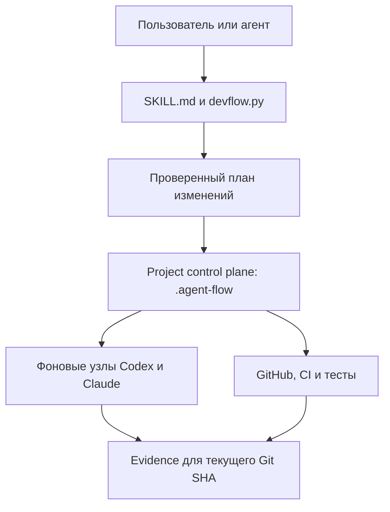

# Архитектура VibeCode Control

Документ описывает фактическую архитектуру версии `0.1.0`. Он фиксирует компоненты, источники истины, потоки данных и границы доверия. Правила работы агентов и quality gates находятся в тематических файлах из [`references`](../references).

## Назначение системы

VibeCode Control добавляет в отдельный продуктовый репозиторий локальный управляющий слой для AI-разработки. Этот слой:

- хранит исполняемую конфигурацию ролей и workflow;
- строит безопасные планы файловых изменений;
- проверяет целостность графа и зависимых скиллов;
- выполняет preflight фоновых узлов;
- связывает результаты проверок с Issue, PR и текущим Git SHA.

Система не исполняет GitHub rulesets, CI и branch protection вместо внешних платформ. Она проверяет локальную часть процесса и требует отдельно подтвердить удалённые гейты через доступный адаптер.

## Компоненты

| Компонент | Расположение | Ответственность |
|---|---|---|
| Скилл | [`SKILL.md`](../SKILL.md) | Определяет, когда и как агент использует VibeCode Control |
| Публичный CLI | [`scripts/devflow.py`](../scripts/devflow.py) | Инспекция, планы, apply/verify/rollback, настройка, аудит и preflight |
| Project kit | [`assets/project-kit`](../assets/project-kit) | Шаблоны конфигурации, графа, схем, prompts и managed-блоков |
| Project-local CLI | `.agent-flow/devflow.py` в подключённом проекте | Самодостаточная копия CLI для дальнейшей работы без зависимости от личной установки |
| Управляющие данные проекта | `.agent-flow/config.json`, `workflow.json`, `skills.lock.json` | Роли и модели, state machine, skill dependencies и решения по узлам |
| Project-scoped skills | `.agents/skills` и `.claude/skills` | Явно доставленные и проверяемые инструкции для фоновых Codex и Claude |
| Локальные артефакты | `.agent-flow/.local` | Планы, отчёты, manifests, rollback payloads и run evidence; не коммитятся |
| Внешние гейты | GitHub, CI, tests, runners | Фактическое принуждение к required checks, review, merge policy и выполнению кода |

## Поток управления



Основная последовательность изменения проекта:

```text
inspect → normalize → plan → dry-run → apply → verify → reconcile
```

1. `inspect` собирает факты без записи.
2. `init`, `adopt`, `upgrade` или `plan` строят типизированный набор операций и diff.
3. `apply` повторно проверяет fingerprint репозитория, пути и pre-hash каждого файла.
4. Файлы записываются атомарно; для запуска сохраняется manifest с предыдущими байтами.
5. `verify` подтверждает результат, а `rollback` может вернуть конкретный запуск, только если после apply не появился drift.

## Установленный управляющий слой

После `init --apply` или `adopt --apply` проект получает следующую структуру:

```text
.agent-flow/
├── devflow.py
├── config.json
├── config.schema.json
├── workflow.json
├── workflow.schema.json
├── skills.lock.json
├── setup-stages.json
├── toolkit/
├── vendor-skills/
└── .local/                 # исключён из Git

.agents/skills/devflow-node/
.claude/skills/devflow-node/
.github/devflow/prompts/
.github/ISSUE_TEMPLATE/devflow-task.yml
```

VibeCode Control также добавляет или обновляет только помеченные managed-блоки в `AGENTS.md`, `CLAUDE.md`, `.gitignore` и шаблоне PR. Существующий пользовательский текст вокруг этих блоков сохраняется.

## Источники истины

Единого файла с максимальным приоритетом для всех вопросов нет. Источник выбирается по типу факта:

| Вопрос | Канонический источник |
|---|---|
| Что реально работает | `main`, код, тесты и свежая эксплуатационная проверка |
| Что сейчас разрабатывается | Текущий head открытого PR, review threads и CI |
| Что должен выполнить агент | Ready Issue и его актуальные комментарии |
| Что входит в продукт | Утверждённый scope и product rules |
| Приоритеты и этапы | Roadmap, tracking Issues и последнее явное решение PM |
| Как исполняется AI-процесс | `AGENTS.md`, `CLAUDE.md`, `.agent-flow/config.json` и `workflow.json` |
| Какие скиллы разрешены | `.agent-flow/skills.lock.json` и проверенные materialized copies |

Для продуктовых решений последнее явное решение PM имеет приоритет. Для фактического поведения источником остаются код и свежие проверки.

## Модель конфигурации и workflow

### Конфигурация

`.agent-flow/config.json` отделяет логическую роль от конкретного исполнителя. Для роли хранятся:

- `agent`;
- `model`;
- `effort`;
- `permissions`.

Точечные `node_overrides` применяются только к указанному узлу. Значение `inherit` означает, что модель выбирается реальной платформой; оно не доказывает доступность конкретной модели.

### State machine

`.agent-flow/workflow.json` — единственный канонический граф. Каждый узел содержит входное условие, действие, роль, разрешения, входы, ожидаемые доказательства, проверки и timeout. Каждое ребро содержит именованное условие, ограничение повторов и явный выход при ошибке.

Валидатор блокирует, среди прочего:

- недостижимые узлы и ветки без терминального выхода;
- неизвестные роли и небезопасные условия;
- бесконечные циклы или retries без границы;
- merge-path без проверенного head SHA и обязательных проверок;
- обязательный скилл, недоступный фактическому исполнителю.

Mermaid и табличное представление генерируются из этого JSON, а не редактируются вручную.

## Управление зависимыми скиллами

Skill Dependency Manager использует три уровня хранения:

1. Канонический внешний Git checkout на полном commit SHA — источник для первоначального аудита.
2. `.agent-flow/vendor-skills/<name>` — закреплённая проектная копия.
3. `.agents/skills/<name>` и/или `.claude/skills/<name>` — materialized copies для конкретных фоновых платформ.

`.agent-flow/skills.lock.json` хранит provenance, checksum дерева, лицензию, targets, даты аудита и пересмотра, назначения по узлам и решение `zero-skill`, если дополнительный скилл не нужен.

Обычный фоновый запуск только сверяет присутствие и checksum. Он не ищет и не обновляет скиллы через сеть.

## Границы доверия

### Локально проверяется

- структура и содержимое конфигурации;
- достижимость и ограниченность workflow;
- разрешённые пути файловых операций;
- fingerprint, pre-hash и post-hash;
- целостность project-scoped skills;
- наличие ожидаемого evidence;
- совпадение локального Git HEAD с записываемым head SHA.

### Требует внешней проверки

- GitHub rulesets и branch protection;
- фактический набор required checks;
- состояние review threads и merge policy;
- права GitHub Actions и других runners;
- доступность выбранной модели и effort на конкретной платформе;
- фактический CI, deploy и post-merge результат.

Локальный файл workflow не может подтвердить настройку удалённой платформы. Пока внешний адаптер не проверил состояние, соответствующий слой остаётся `PARTIAL` или `BLOCKED`.

## Данные и хранение

В Git коммитятся:

- конфигурация, schemas и workflow;
- `skills.lock.json` и проверенные project-scoped copies;
- prompts, agent rules, Issue/PR templates;
- каноническая документация.

В `.agent-flow/.local/` и вне Git остаются:

- сохранённые планы и inspection reports;
- apply/rollback manifests;
- evidence отдельных запусков;
- локальные lock-файлы операций.

Секреты, `.env`, токены, приватные ключи, реальные персональные данные и приватные ссылки не должны попадать ни в одну из этих зон.

## Правила изменения архитектуры

Изменение ответственности компонента, схемы данных, workflow, интеграции, хранения или trust boundary требует в одном PR:

1. изменения кода или project kit;
2. обновления этого документа;
3. обновления schema и regression-тестов, если меняется контракт;
4. проверки миграции существующих установленных проектов;
5. усиленного review guardrail-файлов.

Автоматический `upgrade` обновляет только известную версию схемы и не заменяет пользовательскую конфигурацию шаблоном. Неизвестная или повреждённая схема требует отдельного проверенного migration plan.

## Связанные документы

- [Configuration and graph](../references/configuration-and-graph.md)
- [Product, delivery, and quality rules](../references/process-and-quality.md)
- [Skill governance](../references/skill-governance.md)
- [Background adapters, GitHub, CI, and security](../references/adapters-and-security.md)
